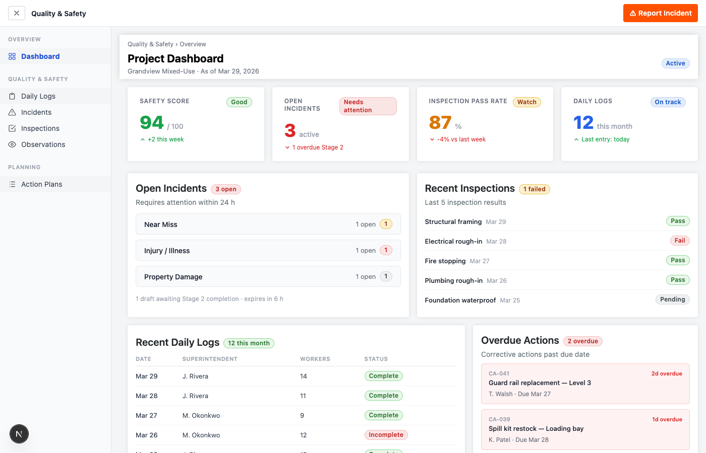
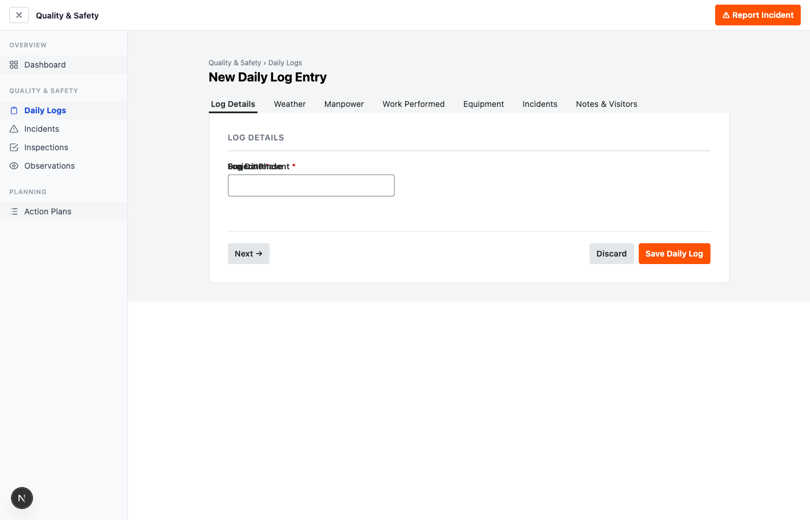
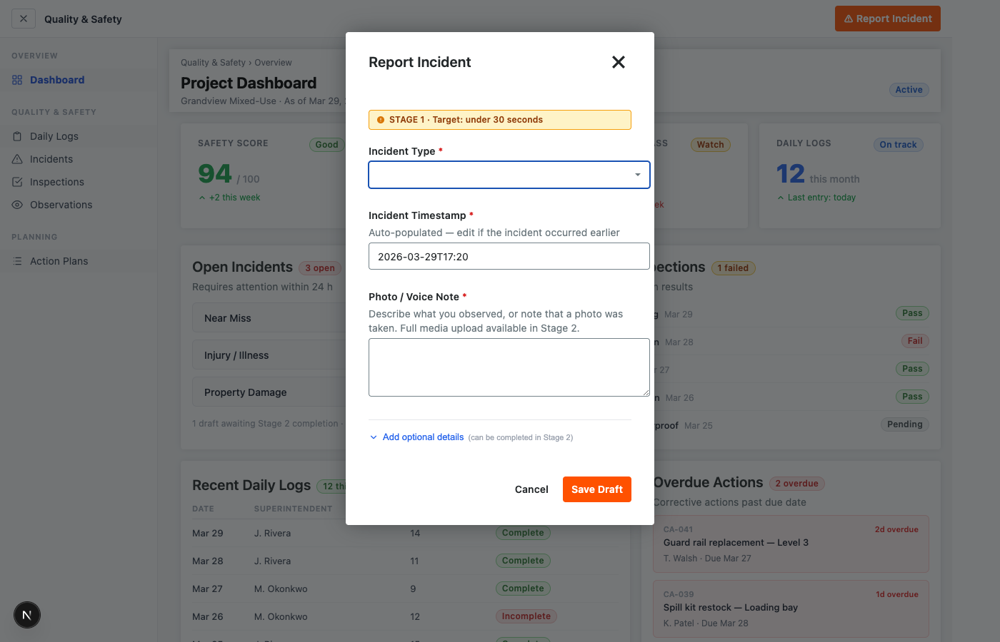

# my-procore-prototype

A Procore Quality & Safety UI prototype built with [Next.js](https://nextjs.org/) and the [`@procore/core-react`](https://www.npmjs.com/package/@procore/core-react) component library.

---

## Screenshots

### Dashboard
Project status at a glance — KPI cards, open incidents, inspection results, daily logs, overdue actions, and weather.



### Daily Log Entry
A 7-tab form (Log Details, Weather, Manpower, Work Performed, Equipment, Incidents, Notes & Visitors) built with Procore Form components and Formik.



### Stage 1 Quick Capture
One-tap incident reporting in under 30 seconds. Captures incident type, timestamp, and an optional photo/voice note. Triggers a persistent Stage 2 reminder banner.



---

## Features

- **Dashboard** — KPI cards (Safety Score, Open Incidents, Inspection Pass Rate, Daily Logs), incident breakdown, inspection summary, recent daily logs table, overdue corrective actions, and site weather.
- **Daily Log Form** — Tabbed entry form with date/superintendent auto-fill, weather conditions, manpower tracking, and work narrative fields.
- **Stage 1 Quick Capture** — Modal-based incident capture flow with immutable draft record and Stage 2 reminder banner.
- **Sidebar navigation** — Collapsible sidebar with grouped nav: Overview, Quality & Safety, Planning.

---

## Tech Stack

| Layer | Choice |
|---|---|
| Framework | Next.js 16 (Pages Router) |
| UI library | @procore/core-react v12 |
| Forms | Formik via `useFormContext` |
| Styling | styled-components (SSR via ServerStyleSheet) |
| Language | TypeScript |

---

## Getting Started

```bash
npm install
npm run dev
```

Open [http://localhost:3000](http://localhost:3000).

### Build

```bash
npm run build   # uses --webpack flag for ESM compat
npm start
```

---

## Project Structure

```
src/
  pages/
    index.tsx             # Dynamic import wrapper (ssr: false)
    _document.tsx         # ServerStyleSheet for styled-components
  components/
    AppShell.tsx          # Top bar, sidebar, content routing, modal state
    SidebarNav.tsx        # Grouped nav using Procore Menu
    Dashboard.tsx         # KPI cards and summary panels
    DailyLogForm.tsx      # 7-tab daily log entry form
    QuickCaptureModal.tsx # Stage 1 incident quick capture
```
