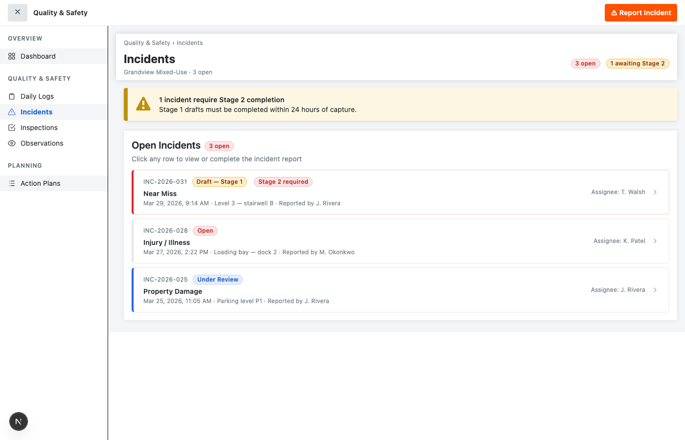
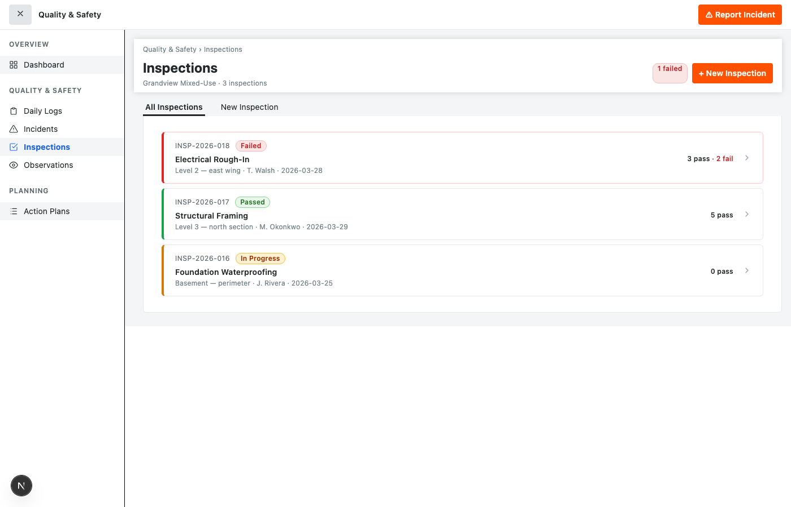
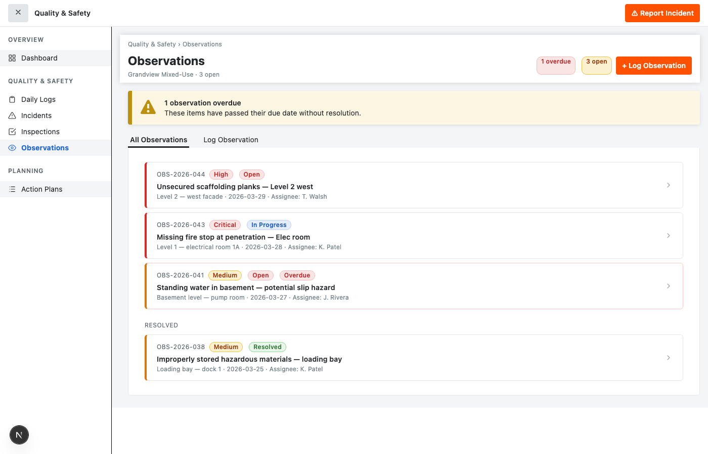
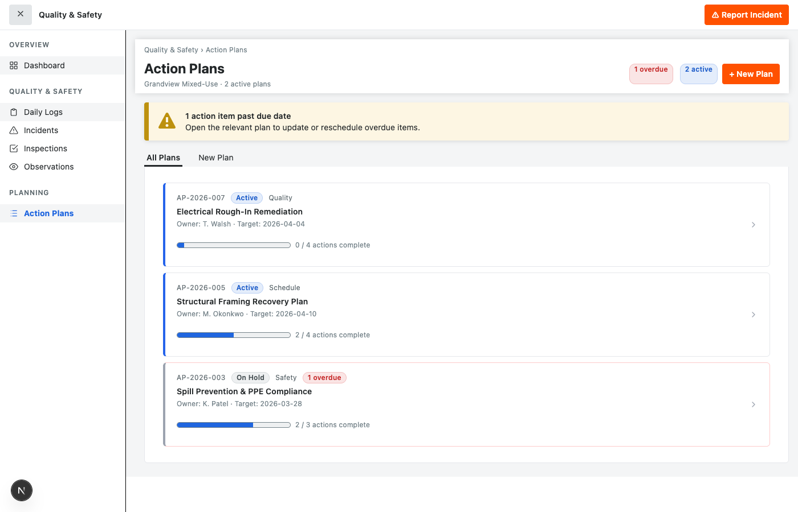

# my-procore-prototype

A Procore Quality & Safety UI prototype built with [Next.js](https://nextjs.org/) and the [`@procore/core-react`](https://www.npmjs.com/package/@procore/core-react) component library.

---

## Screenshots

### Dashboard
Project status at a glance — KPI cards, open incidents, inspection results, recent daily logs, overdue corrective actions, and site weather.


### Daily Log Entry
A 7-tab form (Log Details, Weather, Manpower, Work Performed, Equipment, Incidents, Notes & Visitors) built with Procore Form components.


### Stage 1 Quick Capture
One-tap incident reporting in under 30 seconds. Captures incident type, timestamp, and photo/voice note. Triggers a persistent Stage 2 reminder banner.


### Incidents List
All open incidents with status pills, Stage 2 urgency indicators, and one-click access to full reports.



### Incident Detail — Stage 2 Report
Full incident report form with causal analysis, corrective actions, and witness fields. Pre-populated from Stage 1 draft data.


### Inspections
Checklist-based inspection runner with pass/fail/NA/pending controls, per-item comments, and a live progress bar.



### Observations
Site observation log with severity tagging, assignee tracking, overdue highlighting, and a detail form for corrective tasks.



### Action Plans
Milestone-based quality assurance plans with task completion tracking, progress bars, and status management.



---

## Features

- **Dashboard** — KPI cards (Safety Score, Open Incidents, Inspection Pass Rate, Daily Logs), incident breakdown, inspection summary, recent daily logs table, overdue corrective actions, and site weather.
- **Daily Log Form** — Tabbed entry form with weather conditions, manpower tracking, equipment log, and work narrative fields.
- **Stage 1 Quick Capture** — Modal-based incident capture flow with immutable draft record and persistent Stage 2 reminder banner.
- **Incidents** — List view with status-driven row styling and a full Stage 2 report form (incident details, causal analysis, corrective actions, witnesses).
- **Inspections** — Checklist runner with pass/fail/NA controls, inline comments, and completion progress bar.
- **Observations** — Site condition log with severity levels, assignee management, and overdue detection.
- **Action Plans** — Milestone tracker with per-task completion and aggregated progress bars.
- **Sidebar navigation** — Collapsible sidebar with grouped nav: Overview, Quality & Safety, Planning.

---

## Tech Stack

| Layer | Choice |
|---|---|
| Framework | Next.js 16 (Pages Router) |
| UI library | @procore/core-react v12 |
| Forms | Formik via `useFormContext` |
| Styling | styled-components (SSR via ServerStyleSheet) |
| Language | TypeScript |

---

## Getting Started

```bash
npm install
npm run dev
```

Open [http://localhost:3000](http://localhost:3000).

### Build

```bash
npm run build
npm start
```

---

## Project Structure

```
src/
  pages/
    index.tsx             # Dynamic import wrapper (ssr: false)
    _document.tsx         # ServerStyleSheet for styled-components
  components/
    AppShell.tsx          # Top bar, sidebar, content routing, modal state
    SidebarNav.tsx        # Grouped nav using Procore Menu
    Dashboard.tsx         # KPI cards and summary panels
    DailyLogForm.tsx      # 7-tab daily log entry form
    QuickCaptureModal.tsx # Stage 1 incident quick capture
    IncidentsPage.tsx     # Incident list + Stage 2 report form
    InspectionsPage.tsx   # Checklist-based inspection runner
    ObservationsPage.tsx  # Site observation log
    ActionPlansPage.tsx   # Milestone-based action plan tracker
```
